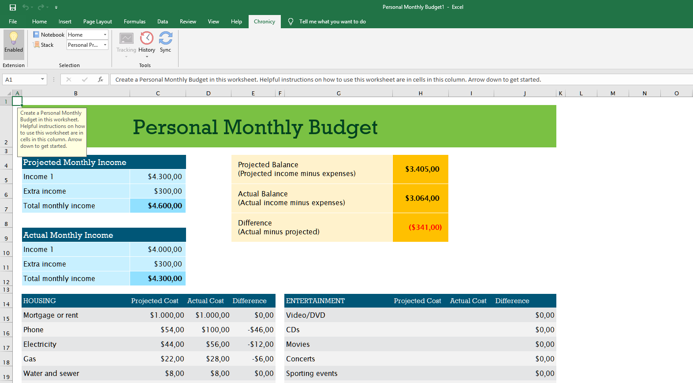
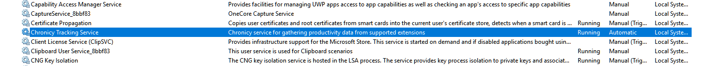

# Chronicy

Chronicy is the new standard in task management. With the help of Chronicy you can track your progress in supported situations automatically. This means there is no need for manually recording your progress when working or playing. Chronicy does it automatically for you, removing the annoyance of classic productivity applications, that required you to spend more time recording how productive you were instead of actually working.

## How does it work?
Chronicy features a three component model in order to most efficiently track your activity. The three core parts of Chronicy are:
* A background service that listens for changes and raises events
* Extensions that allow third party application to register their progress in the Chronicy system
* A GUI application that allows you to communicate with the Chronicy system. This is what gives a normal user the possibility to log custom data and configure the application

## User Interface
Chronicy features a simple interface that gives you a clear overview of what you are working on.

The Microsoft Excel extension

*More Office application extensions coming soon!*

The Safari browser extension

The Windows service that collects data sent by extensions

[comment]: <> (The Chronicy web service that allows your stored information to be carried cross-computer and cross-platform)

[//]: 

## Upcoming Features

- [ ] Windows service and Office extensions
- [ ] Web service
- [ ] Cross platform communication
- [ ] Application installer

## Platform Support
|   Platform   |    Status    |          Available Components          |
| ------------ | ------------ | -------------------------------------- |
| Windows      | WIP          | Windows Service and Office Extensions  |
| macOS        | Supported    | Desktop app and Safari extension       |

## Technologies Used
#### Windows
* C# 7.2
* .NET Framework 4.7.2
* Windows Communication Framework
* Newtonsoft JSON
* NLog
* NUnit

#### macOS
* Swift 5
* Cocoa
* CocoaPods
* Alamofire
* FatSidebar

## Disclaimer
I do not own any of the following:
* The icons used by Chronicy. They are provided by the people on [Icons8.com](https://icons8.com).
* The main WordArt image used on this page. It is generated using [WordArt.com](https://wordart.com)

I state that I do not claim ownership of any of the items listed in the *Disclaimer* section of this document and I don't intend to infringe on their respective owner's copyright grounds.