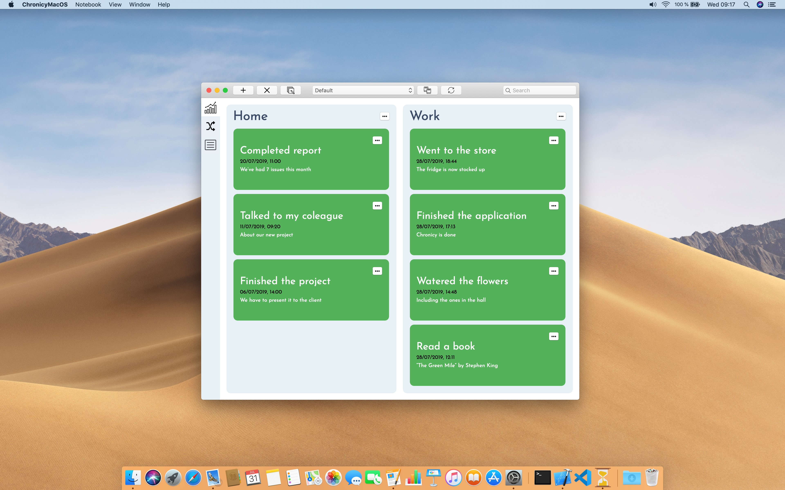
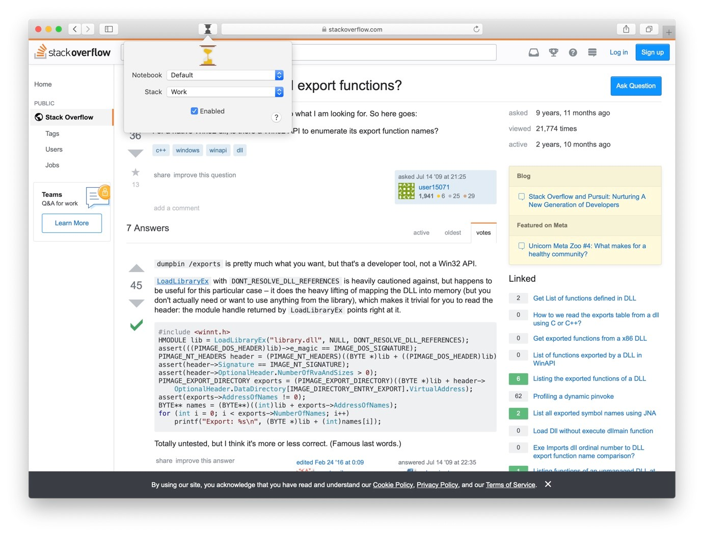
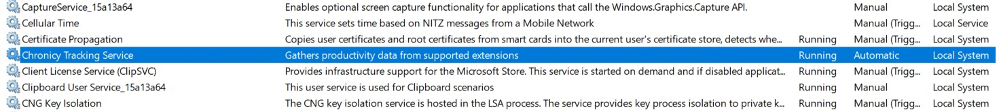
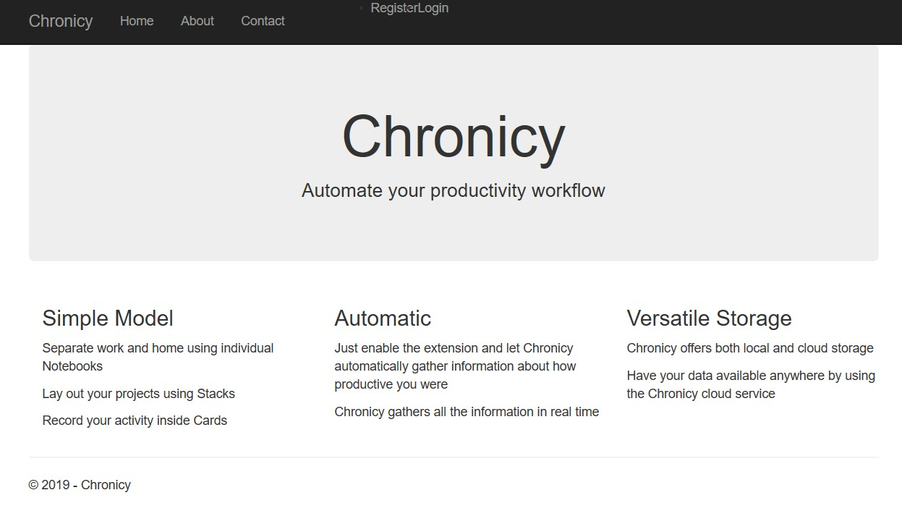

# Chronicy

Chronicy is the new standard in task management. With the help of Chronicy you can track your progress in supported situations automatically. This means there is no need for manually recording your progress when working or playing. Chronicy does it automatically for you, removing the annoyance of classic productivity applications, that required you to spend more time recording how productive you were instead of actually working.

## How Does it Work?
Chronicy features a three-component model, in order to most efficiently track your activity. The three core parts of Chronicy are:
- A background service that listens for changes and raises events
- Extensions that allow third party application to register their progress in the Chronicy system
- A GUI application that allows you to communicate with the Chronicy system. This is what gives a normal user the possibility to log custom data and configure the application

Chronicy features both local storage and cloud storage. This way, you can store your data locally or share it between your devices.

## Features
- Tracking your actions in supported applications via extensions
- Automatic insertion of daily activities into your application
- Modern, fluid user interface
- Safe storage of your data inside a database
- Low memory footprint

## User Interface
Chronicy features a simple interface that gives you a clear overview of what you are working on.

The Microsoft Excel extension

*More Office application extensions coming soon!*

The Safari browser extension

The Windows service that collects data sent by extensions

The Chronicy web service that allows your stored information to be carried cross-computer and cross-platform

## Upcoming Features
- [x] Windows service and Office extensions
- [x] Website and web service
- [x] Cross platform communication
- [ ] Encrypted storage
- [ ] Application installers

## Platform Support
|   Platform   |    Status    |                Components              |
| ------------ | ------------ | -------------------------------------- |
| Windows      | Supported    | Desktop app, Windows Service and Office Extensions  |
| macOS        | Supported    | Desktop app and Safari extension       |
| Web          | Supported    | Website and API                        |

## The Technologies That Power Chronicy

#### Windows

Code
- [C# 7.3](https://docs.microsoft.com/en-us/dotnet/csharp/whats-new/csharp-7-3)
- [.NET Framework 4.7.2](https://dotnet.microsoft.com/)
- [Universal Windows Platform](https://docs.microsoft.com/en-us/windows/uwp/get-started/universal-application-platform-guide)
- [Windows Communication Foundation](https://docs.microsoft.com/en-us/dotnet/framework/wcf/whats-wcf)
- [Newtonsoft JSON](https://github.com/JamesNK/Newtonsoft.Json)
- [NLog](https://github.com/NLog/NLog)
- [NUnit](https://github.com/nunit/nunit)
- [SQLite](https://github.com/praeclarum/sqlite-net)
- [Entity Framework Core](https://github.com/aspnet/EntityFrameworkCore) (Local storage only)
- [Humanizer](https://github.com/Humanizr/Humanizer)

Setup
- [InnoSetup](http://www.jrsoftware.org/isinfo.php)
- [VstoAddinInstaller](https://github.com/bovender/VstoAddinInstaller)
- [inno-download-plugin](https://github.com/andykimpe/inno-download-plugin)

#### macOS
- [Swift 5](https://swift.org/)
- [Cocoa](https://en.wikipedia.org/wiki/Cocoa_(API))
- [CocoaPods](https://github.com/CocoaPods/CocoaPods)
- [Alamofire](https://github.com/Alamofire/Alamofire)
- [FatSidebar](https://github.com/CleanCocoa/FatSidebar)

#### Web
- [C# 7.3](https://docs.microsoft.com/en-us/dotnet/csharp/whats-new/csharp-7-3)
- [.NET Core 2.2](https://dotnet.microsoft.com/)
- [ASP.NET Core](https://github.com/aspnet/AspNetCore)
- [Microsoft SQL Server](https://www.microsoft.com/en-us/sql-server/sql-server-2017)
- [Newtonsoft JSON](https://github.com/JamesNK/Newtonsoft.Json)
- [NLog](https://github.com/NLog/NLog)

## Things That Inspired Chronicy
- [GitHub's project boards](https://help.github.com/en/articles/about-project-boards) - This has been the main point of inspiration for the stack based, board-like workflow
- [SpotifyAPI-NET](https://github.com/JohnnyCrazy/SpotifyAPI-NET) - Chronicy uses a modified implementation of the client-side API
- [AspNetCore.Docs](https://github.com/aspnet/AspNetCore.Docs) - The Chronicy website uses a view controller-based CRUD implementation similar to the one defined by Microsoft in their AspNetCore documentation sample code. Also, the user authentication system is based on Microsoft's ASP.NET Identity examples.

## Disclaimer
I do not own any of the following:
- The icons used by Chronicy. They are provided by the people on [Icons8.com](https://icons8.com).
- The main WordArt image used on this page. It is generated using [WordArt.com](https://wordart.com)

I state that I do not claim ownership of any of the items listed in the *Disclaimer* section of this document and I don't intend to infringe on their respective owner's copyright grounds.
